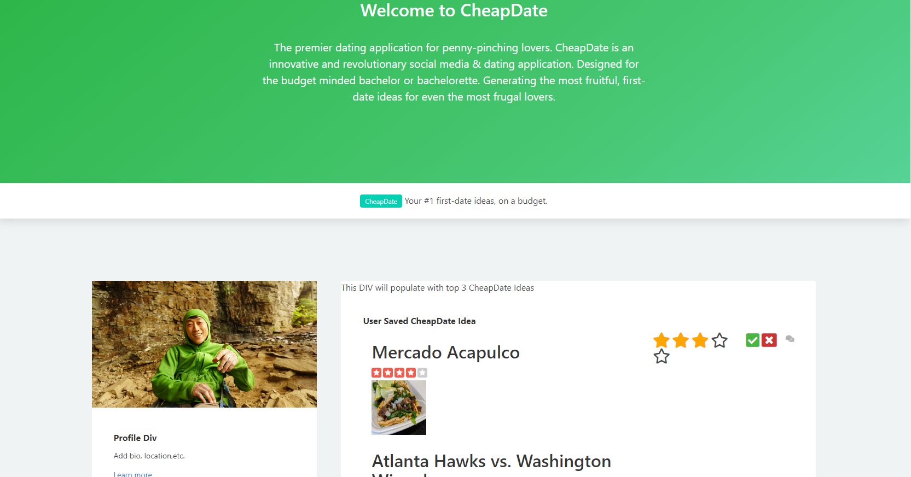

# Introducing: CheapDate
"Not Cute. But Cheap."

## Welcome Thirsty Thrifty Singles, 

CheapDate is the premier dating application for penny-pinching lovers. CheapDate is an innovative and revolutionary social media & dating application. Designed for the budget minded bachelor or bachelorette.  Generating the most fruitful, first-date ideas for even the most frugal lovers.

CheapDate uses ground-breaking technologies to design the perfect, in-expensive first date ideas. Built exclusively for the most thrifty and thirsty singles; swimming in today's dating pool. Our leading edge technology autonomously generates perfect first date ideas that allows our "Bargain Bachelors" & "Budget Bachelorettes" the ability to Save, Rate and Track their favorite CheapDate ideas.   

What separates CheapDate from it's competitors is our truly revolutionary pairing algorithm. Gone are the days of just shallowly swiping on people's photos or super-liking that catchy personal bio. With CheapDate - user "matches" are paired together via the CheapDateIdeas they have mutually saved, rated and their personal success rate.

# User Story
**AS A budget minded bachelor or bachelorette:**

_I WANT to find the highest rated movies in theatres & most in-expensive, yet highly rated restaurants in my city. 
SO THAT I can create a dating profile list based on my saved cheap date ideas. 

I WANT to pair a selected Movie from Fandango with a restaurant from Yelp that only has one $ rating and AT LEAST a 3-Star Review.
SO THAT I can create a list of “CheapDateIdeas”.

I WANT to be able to create and view multiple Cheap Date Ideas 
SO THAT I can give them a star ranking/rating & be able to mark a check box if the date was a Success Or Failure.

I WANT to be able to save my CheapDateIdeas to my profile page.
SO THAT I can have a record of my saved ideas and for matching purposes. 

I WANT to be able to sort my CheapDateIdeas by Star Ranking and Success Rate.
SO THAT users can view their best performing CheapDate Ideas._ 

# Team Members & Role Assignment

- Adam Kovacevich: Project Lead. ALL Teams
- John Quintanilla: API Lead, All Teams
- Aubrey Cook: HTML, CSS, Javascript Teams
- Alondra Ortega: HTML, CSS, Javascript Teams

# Teams
- HTML
- CSS + Framework
- Javascript
- API
>Team Leads are responsible for organizing & managing respective features to the CheapDate App.

## CheapDate Technologies Stack
- HTML
- CSS
- Bulma CSS Framework
- Javascript + JQuery
- Yelp! API
- Movieglu API
- Ticket Master API

## Screenshots & Demo

## Directions for Future Development
For future implementations, we would like to add other APIs to our application to create more date options in our database. For example, a combination of dinner and an event chosen from a Groupon api, or a pop up bar event combined with
a concert gathered from the Livenation api. Maybe even include an option to add ridesharing to that event.
We would also like to implement more specific search parameters to make for a much more personal user experience. 
Eventually, we would like to add mobile access to our application, creating a touch and swiping mechanism for ease of use.

We want the user able to not only choose between different date options but swipe through different personalized profiles that other frugal-minded people have created.

We want to get to a point where we can match people that have chosen similar filters on their date profiles. For example: if I want to go to a concert or an event, I can just open my app and swipe to see if anybody is interested in going
to that concert with me, and perhaps add a dinner option prior to that event without the need to open any other apps. 

## Credits

Yelp API: Gets data for recommended restaurants based on user's location input.
https://www.yelp.com/developers/documentation/v3/get_started

Movieglu API: Gets data for movie theaters based on user's location input. 
https://developer.movieglu.com/
>Deprecated due to reaching max limit for api calls. Still waiting on response from Support for additional calls.

Ticket Master API: Gets data for local events and attractions based on user's location input.
https://developer.ticketmaster.com/

## License
MIT License

Copyright (c) [2021] [Adam Kovacevich, John Quintanilla, and Aubrey Cook]

Permission is hereby granted, free of charge, to any person obtaining a copy
of this software and associated documentation files (the "Software"), to deal
in the Software without restriction, including without limitation the rights
to use, copy, modify, merge, publish, distribute, sublicense, and/or sell
copies of the Software, and to permit persons to whom the Software is
furnished to do so, subject to the following conditions:

The above copyright notice and this permission notice shall be included in all
copies or substantial portions of the Software.

THE SOFTWARE IS PROVIDED "AS IS", WITHOUT WARRANTY OF ANY KIND, EXPRESS OR
IMPLIED, INCLUDING BUT NOT LIMITED TO THE WARRANTIES OF MERCHANTABILITY,
FITNESS FOR A PARTICULAR PURPOSE AND NONINFRINGEMENT. IN NO EVENT SHALL THE
AUTHORS OR COPYRIGHT HOLDERS BE LIABLE FOR ANY CLAIM, DAMAGES OR OTHER
LIABILITY, WHETHER IN AN ACTION OF CONTRACT, TORT OR OTHERWISE, ARISING FROM,
OUT OF OR IN CONNECTION WITH THE SOFTWARE OR THE USE OR OTHER DEALINGS IN THE
SOFTWARE.

## Links to Deployed App & GitHub Repo
- DEPLOYED: https://kovaceva11.github.io/CheapDate/
- REPOSITORY: https://github.com/Kovaceva11/CheapDate

<!-- Api Keys **DELETE ALL OCCURRENCES AFTER GRADES ARE RECEIVED!**

Yelp: Client ID
dEyl7xSBkAUmE4oa8rQH-A

API Key
68bbHwsCWL4OAYGtkSOWSf2JFp7C2zbjnUxztytfSKJmA2cddY0ahKSeO6agzuI9Bf-nC3XII8n1qIPAZQHdrjzu0E4xiPcvWUINsr7NZ5xZgPiBiSbc6HfMUwmwYXYx -->

<!-- API for ticketmaster.
  ticketMaster_APIkey = "8njJQoW0vprJ4q925GfuaN5cdSBvPiGT";
  ticketMasterSecret = "fvGGPygkGqrdUC6y"; -->
